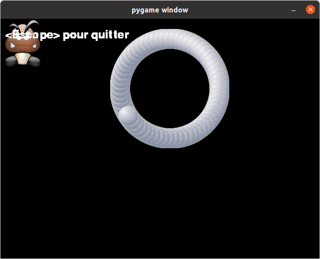

# Les courbes paramétriques

Dans ce cours, nous verrons comment coder des déplacements relativement
complexes. Pour cela, nous allons utiliser ce que les mathématiciens appellent
des courbes paramétriques.


Commencons simplement : Imaginons que je veuille coder le déplacement le long
d'un cercle, au fur et à mesure du temps.

## Déplacement circulaire

si je me souviens vaguement de mes cours de maths, je peux imaginer le cercle
unitaire, centré sur 0, et de rayon 1, représenté sur la figure suivante :


Cette figure me donne aussi les coordonnées d'un point du cercle à un instant t (à un angle t) :

Imaginons que t varie de 0 a 1000, par exemple,
on pourrait calculer la position x, y de chaque point avec :
```python
x = cos(t)
y= sin(t)
```

Ceci me permettrait de tracer la courbe suivante :


En revanche, ce cercle est centré sur le point (0,0).
Pour le centrer sur le point (250, 200), il faut decaler $x$ et $y$ respectivement de 250 et 200.
C'est une **translation**.
le code devient :

```python
x = cos(t) +250
y= sin(t) +200
```

Ce qui nous donne ce cercle :


Si je veux agrandir mon cercle pour lui donner un rayon de 50 pixels, il faut
jouer sur l'amplitude du cosinus et du sinus. Les deux varient entre -1 et 1.
Pour les faire varier de -50 a 50 pixel, il faut que je multiplie le cosinus et
le sinus par le rayon voulu (50)

```python
x = 50*cos(t) +250
y= 50*sin(t) +200
```

Ce qui nous donne ce cercle :


Reste à regler la vitesse à laquelle je me déplace sur ce cercle.

- Je commence à t=0, au point (1,0).
- puis t=1, j'arrive au point (cos(1),sin(1))
- puis t=2, j'arrive au point (cos(2),sin(2))

A chaque fois, j'augmente l'angle de 1 radian, soit en gros 60 degrés (57;29).
Je fais donc 1/6 de tour a chaque fois que j'augmente le temps d'une unité

Il va falloit se déplacer moins vite. Pour cela, je vais ralentir le déplacement.
Disons que lorsque le temps augmente de 1, l'angle va augmenter d'un 10 de radian
(en gros, 6 degrés)

```python
x = 50*cos(t/10) +250
y= 50*sin(t/10) +200
```

Cela nous donne le cercle, mais je l'ai parcouru moins vite.


## Pygamons ceci

Bon, reste à intégrer tout cela à pygame.
Pour cela, c'est simple,
je vais créer une classe **DeplacementTordu**, qui propose une méthode
*deplacer* mettant en oeuvre ce déplacement.

Pour cela, quand je crée un element de type **DeplacementTordu**, c'est un
ElementGraphique, tel que ceux vus au cours 1. Mais je lui ajoute 4 attributs :
- *t*, initialisé a 0, qui représentera le temps écoulé depuis la création
de l'objet
- *truc*, qui vaut 10, qui représente le facteur existant entre le temps et le
déplacement angulaire...
- *centerx* : l'abscisse du centre du cercle
- *centery* : l'ordonnée du centre du cercle

```python
class DeplacementTordu(ElementGraphique):
    def __init__(self, window, img, x=0, y=0):
        ElementGraphique.__init__(self, window, img, x, y)
        self.t = 0.0
        self.truc = 10
        self.centerx = x
        self.centery = y
```

Dans cette classe, j'ajoute une méthode deplacer, qui augmente le temps d'une
unité, et recalcule la position du rectangle de mon Element :

```python
def deplacer(self):
    self.t+=1.0 # Je le met en float, histoire de ne pas avoir de problemes

    self.rect.x = 100*math.cos(self.t/self.truc) + self.centerx
    self.rect.y = 100*math.sin(self.t/self.truc) + self.centery
```

Je colle tout ce code dans mon fichier *toutBiten.py* qui sera utilisé par mon
programme principal.
Puis, je mets ceci en oeuvre dans le programme principal suivant :
Dans ce programme, j'ai supprimé l'affichage du fond, pour que vous voyez bien
le déplacement complet de la balle...


```python
from toutBiten import *
import pygame
import random


def lireImages():
  images = {}
  images["fond"] = pygame.image.load("background.jpg").convert()
  images["perso"] = pygame.image.load("perso.png").convert_alpha()
  images["balle"] = pygame.image.load("balle.png").convert_alpha()

  # Choix de la police pour le texte
  font = pygame.font.Font(None, 34)
  images["texte"] = font.render('<Escape> pour quitter', True, (255, 255, 255))

  return images


## Initialisation de la fenetre et création
pygame.init()
#creation de la fenetre

largeur = 640
hauteur = 480
fenetre=pygame.display.set_mode((largeur,hauteur))

# lecture des images, bien rangées dans un dictionnaire
# on trouvera ainsi l'image du joueur dans :
# images["joueur"], et ainsi de suite
# ===============================
images = lireImages()

# creation des objets du jeu
# ===============================
fond = ElementGraphique(fenetre, images["fond"],0,0)

texte = ElementGraphique(fenetre, images["texte"],10,20)

b = DeplacementTordu(fenetre,images["balle"],largeur/2, hauteur/4)

joueur = Joueur(fenetre,images["perso"], 20, 50)

horloge = pygame.time.Clock()

# En avant !
fps = 30
continuer = True
time = 0
while continuer == True :
    horloge.tick(fps)
    time+=1

    # Recuperation de l'etat du clavier et des evenements de souris
    touches = pygame.key.get_pressed();
    evenements = pygame.event.get()


    joueur.deplacer(touches)

    b.deplacer()

    # Affichage des elements
    #fond.afficher()
    joueur.afficher()
    texte.afficher()

    b.afficher()

    # raffraichissement de l'ecran
    pygame.display.flip()

    if touches[pygame.K_ESCAPE]:
        continuer=False


    # On vide la pile d'evenements et on verifie certains evenements
    for event in evenements:   # parcours de la liste des evenements recus
        if event.type == pygame.QUIT:     #Si un de ces evenements est de type QUIT
            continuer = 0      # On arrete la boucle

```

Vous devriez voir quelque chose comme ceci :



Cool. A ce stade, je vous conseille d'essayer de faire le rayon du cercle, son centre, et la vitesse a laquelle on se déplace sur le cercle, en modifiant seulement le code de la fonction *deplacer*.

Vous devriez être en mesure de lui faire faire une ellipse au lieu d'un cercle...


Mais les trucs vraiment classe arrivent maintenant...

## Descente sinusoidale.
Imaginons que je veuille que les ennemis descendent en faisant une belle sinusoide :


Facile :
- On garde le cosinus sur x
- et la position en y suit simplement les valeurs de t...

Voici le code simplifié du déplacement :

```python
x = 50*cos(t/10) +250
y = t
```

Incrustez ceci dans le code de pyghme et testez.
vous pouvez essayer avec

```python
y=2*t
```
ou
```python
y=3*t
```

Quoi qu'il en soit, on sait maintenant définir une composante à *y* pour faire descendre notre objet à vitesse constante...

## Cercle descendant

Comment pourrais je avoir quelque chose comme
une trajectoire circulaire, mais qui descende au fur et à mesure :


Facile : Il suffit de reprendre l'equation du cercle, et de lui ajouter une composante qui descende.

```python
x = 50*cos(t/10) +250
y = 50*sin(t/10) +200 +t
```

## Des courbes plus chelou

Les courbes paramétriques sont un sujet d'étude assez commun en mathématiques, a tel point qu'on en connait de nombreuses. Pour nous, informaticiens, il suffit de chercher celles qui pourraient avoir un intérêt pour déplacer nos éléments de jeu vidéo selon des courbes intéressantes.

Vous pourriez par exemple aller regarder ce lien :
[https://fr.wikipedia.org/wiki/Courbe_de_Lissajous](https://fr.wikipedia.org/wiki/Courbe_de_Lissajous)

qui en montre certaines, toutes ayant la forme simplifiée :
```python
x = 50*cos(p*t/10) +250
y = 50*sin(q*t/10) +200
```
avec *p* et *q* entiers.


Je vous mets ci dessous quelques exemples de ces courbes.
Imaginez un boss qui se déplace comme ceci :


ou comme ceci.


ou encore


Voila qui peut enrichir rapidement votre projet de jeu video et changera un peu des déplacements tout moisis d'un *space invaders*...

A vous de jouer avec tout cela...
Sachez qu'il en existe aussi de nombreuses autres, dessinant des coeurs, ou toutes sortes de figures complexes potentiellement utiles.

## Du code tout prêt

Comme toujours, le code présenté existe sous forme de fichiers tout prêts :

- [toutBiten.py](Sources/toutBiten.py) qui contient les classes utiles
- [main04.py](Sources/main04.py) qui contient programme principal


Pour info, le code ayant généré la plupart des courbes de cette page est aussi disponible et **exécutable en ligne**.
Il suffit de suivre [ce lien](https://colab.research.google.com/drive/1KJVua7l1PqoIMkp_j9yGb3cddidT9VwE?usp=sharing).
Il vous faudra néanmoins un compte chez Google pour l'exécuter.

Bon travail.
