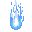
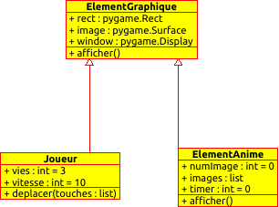
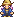
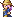
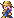
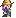
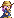

# Les animations

Bon, vu que certains ont du mal avec la notion de hierarchie de classes,
je vais reprendre calmement...

## Point de départ : pas d'animations

On repart avec nos classes :
- *ElementGraphique* : une image, un rect, sait s'afficher
- *Joueur* : un *ElementGraphique* avec un nombre de vies et une fonction de
deplacement dépendant des touches appuyées...

Pour le moment, notre main ressemble à ceci (j'ai supprimé le texte pour simplifier un peu) :

```python
from toutBiten import *
import pygame
import random

def lireImages():
  images = {}
  images["fond"] = pygame.image.load("background.jpg").convert()
  images["perso"] = pygame.image.load("perso.png").convert_alpha()
  images["balle"] = pygame.image.load("balle.png").convert_alpha()

  return images

def ajouterBalles(balles, images, compteur, fps, duree):
  if compteur/fps % duree==0:
    balles.append(ElementGraphique(fenetre,images["balle"],random.randint(0,largeur), random.randint(0,hauteur)))


## Initialisation de la fenetre et création
pygame.init()
#creation de la fenetre

largeur = 640
hauteur = 480
fenetre=pygame.display.set_mode((largeur,hauteur))

# lecture des images, bien rangées dans un dictionnaire
# on trouvera ainsi l'image du joueur dans :
# images["joueur"], et ainsi de suite
# ===============================
images = lireImages()

# creation des objets du jeu
# ===============================
fond = ElementGraphique(fenetre, images["fond"],0,0)

# creation du tableau de balles vide
balles=[]

joueur = ElementGraphique(fenetre,images["perso"], 20, 50)

horloge = pygame.time.Clock()

# En avant !
fps = 30
continuer = True
time = 0
while continuer == True :
    horloge.tick(fps)
    time+=1

    # Recuperation de l'etat du clavier et des evenements de souris
    touches = pygame.key.get_pressed();
    evenements = pygame.event.get()

    # on ajoute des balles toutes les 1 secondes.
    ajouterBalles(balles, images, time, fps, 1)


    # Affichage des elements
    fond.afficher()
    joueur.afficher()

    for b in balles:
        b.afficher()
        print(b.rect)

    # raffraichissement de l'ecran
    pygame.display.flip()

    if touches[pygame.K_ESCAPE]:
        continuer=False


    # On vide la pile d'evenements et on verifie certains evenements
    for event in evenements:   # parcours de la liste des evenements recus
        if event.type == pygame.QUIT:     #Si un de ces evenements est de type QUIT
            continuer = 0	   # On arrete la boucle
```

Tout ceci est réuni dans deux fichiers :
- [main.py](../Sources/Animations/main.py) : le pg principal
- [toutBiten.py](../Sources/Animations/toutBiten.py) : les classes

notez que le fichier *toutBiten.py* contient déja toutes les classes que nous
utiliserons plus bas dans ce cours...

Si je résume, je n'ai globalement que deux classes dans mon jeu :


- Le fond, les balles sont des **instances** de *ElementGraphique*
- le joueur est une instance de *Joueur*


## Transformations des balles en animations.

Je veux modifier mon code pour que les balles qui aparaissent soient maintenant animées. **Mais**, je ne veux pas tout casser.

- rien de ce qui ne concerne pas les balles ne doit être modifié
- ce qui concerne les balles doit être modifié aussi peu que possible.

Voyons ce "aussi peu que possible"...

### Lecture des Images de l'animation

----

**Copyright/Attribution Notice** :
Ces images ont été crées par Stephen Challener (Redshrike)
et récupérées sur le site [opengameart](www.opengameart.org)

----

Il me faut des images pour l'animation. J'ai pris une flamme,
avec 4 images... Chaque image a un nom de type *flameBall_X.png*
avec *X* un entier.




Recupérez les et sauvez les dans le répertoire de votre main...

Celui ci doit les lire, et les ranger. Pour des raisons pratiques, je vais les
mettre dans une liste, elle meme rangée dans mon dictionnaire d'images qui sert
à tout mon jeu.
Cette lecture d'image est toujours faite au début du jeu, par la fonction
*lireImages*.

La fonction lecture *lireImages* devient donc :
```python
def lireImages():
  images = {}
  images["fond"] = pygame.image.load("background.jpg").convert()
  images["perso"] = pygame.image.load("perso.png").convert_alpha()
  images["balle"] = pygame.image.load("balle.png").convert_alpha()

  images["flame"] = []
  for i in range(4):
      images["flame"].append(pygame.image.load("flameBall_"+str(i)+".png").convert_alpha())

  return images
```

Dans mon dictionnaire, dans la case *"flame"*, j'ai bien un tableau dont chaque
case contient une image de la flamme.

### Création d'une classe pour les elements animés.

Encore une fois, je ne veux pas modifier le code concernant le fond ou le
joueur. Je veux juste avoir la possibilité que certains éléments soient en fait
animés...

=> **Je ne modifie pas la classe ElementGraphique**. Elle est très bien.
Par contre, je vais ajouter une nouvelle classe pour représenter ces éléments
animés.

Cette classe doit aussi avoir une image a afficher et un rect...
c'est donc un *ElementGraphique*, sauf que l'image a afficher va changer
parfois...

Je vais donc créer une classe *ElementAnime*, héritant de *ElementGraphique*.

```python
class ElementAnime(ElementGraphique):
```

#### Constructeur (abus de langage)

Pour la construire, il me faut une méthode *__init__*
à laquelle je passe non plus une image, mais un tableau d'images.

La premiere chose que je vais faire, c'est construire un *ElementGraphique* pour représenter cet objet. Or la classe *ElementAnime* hérite de *ElementGraphique*. *ElementGraphique* est donc la **classe parente** de *ElementAnime*.

Je vais donc appeler la méthode *__init__* d'ElementGraphique
avec une ligne comme suit (*super* veut dire **classe parente** ):
```python
        super.__init__(les param dont a besoin cette fonction)
```

 Mais pour construire un *ElementGraphique*, il lui faut une image, pas une liste. Pas de problème : je lui donne comme image la premiere de ma liste. Ce sera mon image courante dans l'animation.

Puis je définis les variables **spécifiques à ma classe animée**. Je stocke :
- le tableau d'images (*self.images*)
- un timer (pour savoir quand changer d'image)
- le numéro de l'image courante.

Voici donc ma méthode *__init__* de la classe *ElementAnime*
```python

    def __init__(self, window, images, x=0, y=0):
        # Pour construire un element animé, on construit
        # d'abord un element graphique (avec la premiere image de la liste)
        super.__init__(window,images[0],x,y)

        # On ajoute toutes les variables utiles a la gestion de l'animation
        self.images = images
        self.timer = 0  # un timer pour l'animation
        self.numAnim = 0 # le numero de l'image courante
```

#### méthode d'affichage

Reste à s'occuper de l'affichage de l'animation.
Comme je veux changer le moins possible mon code, cette classe va aussi avoir une méthode *afficher* sans argument, comme *ElementGraphique*. On dit qu'on **surcharge** (override) la méthode *afficher*.

Comme la fonction *afficher* est appelée à chaque tour de boucle
par le main, c'est elle qui va incrémenter le timer.

Si le timer dépasse une certaine valeur, on change d'image à afficher :

1. On remet le timer a 0
2. On passe a l'image suivante dans le tableau.
3. Si j'ai fini toutes les images, je recommence a l'image 0

en fait, je gère simplement un numéro correspondant à l'image courante dans mon tableau, et je place cette image dans *self.image*

Puis, on affiche l'image courante.

Le code qui suit est relativement simple, sauf la derniere ligne que je vais expliquer plus bas... dites moi si vous avez du mal.

```python
    def afficher(self) :
        self.timer+=1
        if self.timer > 10: # on change d'image tous les 10 tours de boucles...
            self.timer = 0
            self.numAnim+=1
            if self.numAnim >= len(self.images):
                self.numAnim=0
            self.image = self.images[self.numAnim]

        super().afficher()
```
Tout le contenu du *if* ne servait qu'à mettre la bonne image
dans *self.image*, au bon moment. A la sortie du *if*,
je veux afficher mon image, comme d'habitude. Le plus simple est de dire "Je veux lancer la fonction d'affichage normale d'un *ElementGraphique*". De fait, cette dernière ligne appelle la fonction *afficher* de la classe parente.

Et voila. Reste a s'en servir.

#### Modification du main

Bon, ne reste plus qu'a transformer toutes mes balles créees par mon jeu en *ElementAnime*. Comme je les crées toutes dans la fonction *ajouterBalles*, celle ci devient donc :

```python
def ajouterBalles(balles, images, compteur, fps, duree):
  if compteur/fps % duree==0:
    balles.append(ElementAnime(fenetre,images["flame"],random.randint(0,largeur), random.randint(0,hauteur)))
```
J'ai modifié le type d'élément a créer, et lui ai passé la liste d'images de flammes...

Que modifier de plus ? Rien !

La seule chose que fait le programme principal, c'est afficher les balles avec les lignes suivantes :

```python
for b in balles:
    b.afficher()
```

Maintenant que chaque balle *b* est un *ElementAnime*,
c'est bien la méthode *afficher* de *ElementAnime* qui est appelée.
Donc mes balles sont animées...


Voila.
Tous les éléments que je voudrais animer devront donc hériter de cette classe
(et appeler son constructeur)

le fichier nécessaire est ici :
[mainAnime2.py](../Sources/Animations/mainAnime1.py). Les classes, vous les avez déja
dans *toutBiten.py*

Si je résume, j'ai maintenant 3 classes dans mon jeu :



- le fond est un *ElementGraphique*
- le joueur est un *Joueur*
- les balles sont des *ElementAnime*

Quand on demande à une des ces variables de s'afficher :
- le fond est un *ElementGraphique*, il utilise la méthode afficher des *ElementGraphique*.
- joueur est un *Joueur*, il utilise aussi la méthode *afficher* des *ElementGraphique*
- les balles sont des *ElementAnime*, elles utilisent la méthode *afficher* des *ElementAnime*.

Seul le joueur possède une méthode *deplacer*

#### Ajout de fonctionnalites pour les balles.

Si maintenant je veux creer des balles qui soient animées et qui bougent, le plus simple est de créer une classe *Balle*.
Celle ci héritera de *ElementAnime* et je lui ajouterais une méthode déplacer (que je vais recopier de ceux que je connais).

Je déconseille pour le moment l'héritage multiple. C'est bien, mais ca pose plein de problèmes...

Je pourrais donc faire quelque chose comme suit.
La classe Balle hérite de *ElementAnime*, je lui ajoute quelques parametres utiles pour les déplacements, et une méthode déplacer.

```python
class Balle(ElementAnime):

    def __init__(self, window, images, x=0, y=0):
        # Pour construire un element animé, on construit
        # d'abord un element animé
        super().__init__(window,images,x,y)

        self.t = 0.0
        self.truc = 10
        self.centerx = x
        self.centery = y

    def deplacer(self):
        self.t+=1.0

        self.rect.x = 100*math.cos(self.t/self.truc) + self.centerx
        self.rect.y = 100*math.sin(self.t/self.truc) + self.centery
```

Reste à s'en servir...
Quand j'ajoute une balle, cela doit maintenant être un objet de type *Balle*; donc ma fonction d'ajout devient :

```python
def ajouterBalles(balles, images, compteur, fps, duree):
  if compteur/fps % duree==0:
    balles.append(Balle(fenetre,images["flame"],random.randint(0,largeur), random.randint(0,hauteur)))
```

Et j'ajoute quelque part dans la boucle while de mon *main* une boucle pour déplacer toutes les balles...


```python
  for b in balles:
      b.deplacer()
```

Et c'est tout ! (et ça se met a bouger de partout)

le fichier nécessaire est ici :
[mainAnime2.py](../Sources/Animations/mainAnime2.py). Les classes, vous les avez déja
dans *toutBiten.py*

Si je reprends mon diagramme de classes, il a maintenant cette tête ci :


## Conception des hierarchies de classes

Tout le jeu, en programmation Objet, consiste a créer les "bonnes classes", celles dont les objets vont hériter pour obtenir rapidement les bonnes méthodes et les bons attributs.

Il convient donc de réfléchir un peu à qui doit hériter de quoi...

En gros, pour commencer, je vais réfléchir en terme d'animations pour préparer mes classes.

dans le jeu, il va y avoir :

- des éléments affichés comme des images uniques. Ceux ci vont dériver de *ElementGraphique*.
- des éléments animés. Ceux ci vont dériver de *ElementAnime*.

Voyons quelques applications :

### cas 1

Si dans mon jeu, je veux 4 sortes de monstres, qui se déplacent tous verticalement, avec seulement des images différentes et un nombre de hp différents,
je pourrais créer une classe unique pour ces monstres (qui va mettre en oeuvre le nombre de hp et le déplacement).

Si ces monstres doivent être animés, cette classe devra hériter de *ElementAnime*, sinon, elle héritera de *ElementGraphique*.

### cas 2

Si dans mon jeu, je veux toujours 4 sortes de monstres, avec des déplacements différents. De plus, certains tirent et d'autres non.
Je pourrais faire 2 choses :

### possibilité 1

1. Je crée une classe unique *Monstre*, avec un attribut *type* choisi à l'initialisation, pour distinguer les monstres entre eux. On peut aussi penser à un attribut *peuxTirer* (True ou False) pour savoir s'il tire ou pas.
2. la méthode déplacer (commune) regarde le *type* et, en fonction de sa valeur calcule le déplacement à appliquer.
3. la méthode tirer (commune) regarde l'attribut *peuxTirer* du monstre et en fonction de sa valeur, le fait tirer ou pas.

Le main peut ainsi demander à tous les monstres de se deplacer et de tirer, sous la meme forme, mais chacun le fera a sa sauce.

### possibilité 2

1. Je crée une classe *Monstre* avec comme attribut principal les hp des monstres.
2. Je cree une classe par type de monstre (*Monstre1*, *Monstre2*,...), qui hérite de *Monstre*, et qui met en place les déplacements différents.

A quoi sert la classe commune dans ce cas ?
A deux choses :
- Eviter d'avoir a rajouter un attribut hp a chaque classe de monstre.
- Si vous voulez par exemple que certains de vos monstres puissent tirer, vous pourriez creer une fonction *tirer* dans cette classe, qui ne fait rien.
  - dans votre main, vous dites a tout vos monstres de tirer.
  - dans les classes des monstres qui doivent vraiment tirer, vous **surchargez** la méthode tirer pour qu'ils tirent vraiment.

### Que choisir
Ca dépend. En gros :

- si vos fonctions *deplacer* n'utilisent pas les memes parametres, la possibilité 1 va vous forcer à creer une multitude d'attributs différents pour gérer chacun des déplacements. Par exemple (dx, dy) pour ceux qui vont tout droit et (t, centerx,centery, truc, p, q) pour ceux qui suivent une courbe de lissajous. Votre classe va devenir un gros fourre tout.
- si vos classes ne se distinguent que peu, la possibilité 2 va vous amener à créer une palanquée de classes complêtement inutiles.

Pour le coup, il vous faudrait avoir plus d'expérience pour savoir quel choix faire. Ce projet a pour ambition de vous faire toucher du doigt ces difficultés...

## Animation directionnelle.

Imaginons que je veuille des animations différentes en fonction de la direction que prend mon personnage...

Et voyons si on peut le faire, au moins conceptuellement.

Encore une fois, il me faut des images...

----
Copyright/Attribution Notice:
Art by Charles Gabriel. Commissioned by OpenGameArt.org (http://opengameart.org)

---

Ces images arrivent, comme souvent, sous la forme d'une seule image :


Comme je suis gentil, je les ai déja découpés moi meme pour en obtenir un certain nombre...

Je ne vais m'occuper que de repos, gauche et droite.
voici ces images :

repos :


gauche :




droite :




Il faut donc les stocker intelligemment.

L'idée est que mon personnage va avoir une direction, et que pour cette direction, j'ai une animation qui va se jouer...

On peut donc penser qu'il faut simplement gerer la direction du joueur.
Je mettrais bien ca dans une string, c'est pratique.

mon jeu va donc gérer la direction du personnage avec une chaine qui vaudra :
- "repos" quand il ne bouge pas
- "droite" quand il va a droite
- "gauche" quand il va...

Je peux alors penser a stocker la liste des images correspondant a une direction dans un dictionnaire python.

on aura ainsi un paquet d'image accessible facilement en fonction de sa direction.

| direction | Liste d'images |
|:-:|:-:|
| repos | [repos0] |
| droite| [droite0, droite1, droite2]|
| gauche| [gauche0, gauche1, gauche2]|

Ceci est relativement vite fait, dans ma fonction lireImages

```python
def lireImages():
  images = {}
  images["fond"] = pygame.image.load("background.jpg").convert()
  images["perso"] = pygame.image.load("perso.png").convert_alpha()
  images["balle"] = pygame.image.load("balle.png").convert_alpha()

  images["flame"] = []
  for i in range(4):
    images["flame"].append(pygame.image.load("flameBall_"+str(i)+".png").convert_alpha())

  dicoWizard={}
  dicoWizard["droite"]=[]
  for i in range(3):
    dicoWizard["droite"].append(pygame.image.load("wizard_right_"+str(i)+".png").convert_alpha())

  dicoWizard["gauche"]=[]
  for i in range(3):
    dicoWizard["gauche"].append(pygame.image.load("wizard_right_"+str(i)+".png").convert_alpha())

  dicoWizard["repos"]=[]
  dicoWizard["repos"].append(pygame.image.load("wizard_down_0.png").convert_alpha())

  images["wizard"]=dicoWizard

  return images
```

Bon... ca pique un peu, mais ca va aller. (Dans *toutBiten.py*, j'ai de plus
augmenté la taille des images pour que ce soit plus joli...)

On souhaite maintenant mettre en place ces animations pour le joueur.
Pour le moment, notre joueur est de la classe *Joueur*,
qui hérite de la classe *ElementGraphique* (celle de l'image unique).

Or notre joueur va devoir avoir une animation (comme dans la classe
*ElementAnime*), mais en plus cette animation va changer quand il change de
direction...

Normalement, vous devriez en déduire vous même qu'on va créer une nouvelle
classe (*ElementAnimeDir*) qui va hériter de *ElementAnime*.
On dit aussi que la classe *ElementAnimeDir* dérive de la classe *ElementAnime*.

Je passe au constructeur ce dictionnaire...
```python
class ElementAnimeDir(ElementAnime):

    def __init__(self, window, images_all_dir, x=0, y=0):
```

puis je construit un *ElementAnime* avec la liste d'image de la position "repos"
```python
      super().__init__(window,images_all_dir["repos"],x,y)
```
Et je stocke mes variables utiles : le dictionnaire d'image et la direction
actuelle du joueur. je stocke aussi la direction précédente, ca servira plus
loin.

```python
      self.images_all_dir = images_all_dir
      self.direction="repos"
      self.old_direction="repos"
```

On peut tester ceci dans notre main, avec un joueur crée comme
un *ElementAnimeDir*.

```python
joueur = ElementAnimeDir(fenetre,images["wizard"], 20, 50)
```

Evidemment, notre joueur ne va pas vraiment changer de
direction, mais le programme doit tourner... (et oui, il est tout petit...)


### prise en compte des directions.

Pour faire les choses proprement, je vais surcharger la méthode afficher de
ma classe *ElementAnimeDir* pour qu'elle fasse le changement d'animation au
besoin...

l'idée est simple :
Quand on doit l'afficher, on regarde
si la nouvelle direction de l'element est différente de l'ancienne :
1. on change d'animation. L'animation en cours est l'attribut *self.images* des
*ElementAnim*. c'est lui que je vais modifier.

2. De plus, je mémorise que j'ai déja changé de direction en placant
la direction actuelle dans *self.old_direction*

3. Je remet mon numéro d'animation a 0, car toutes les listes d'animation n'ont
pas la meme taille

```python
def afficher(self) :
    # l'element a changé de direction
    if self.old_direction != self.direction:
        # je mets la nouvelle liste d'images a utiliser dans images.
        self.images = self.images_all_dir[self.direction]

        # je remet le numéro d'anim a 0
        self.numAnim=0

        # je mémorise la direction actuelle comme déja commencée
        self.old_direction = self.direction:

    # et je demande l'affichage de l'animation en cours.
    super().afficher()
```


Ca c'est bon. On voit que de l'exterieur, des que l'attribut *direction*
va changer, tout devrait bien se passer.
Qui sait quand la direction doit changer ?
la méthode *deplacer* du joueur. C'est elle que je dois modifier.

Dans le fichier *toutBiten.py*; j'ai refais une classe *Joueur1* pour que le code
des programmes précédents continue a fonctionner, mais dans la vraie vie, je
modifierais ma classe joueur...

Voici donc ma classe Joueur1 :

```python
class Joueur1(ElementAnimeDir):
    def __init__(self, window, img, x=0, y=0):
        super().__init__( window, img, x, y)
        self.vies = 3
        self.vitesse = 5

    def deplacer(self, touches):
        self.direction="repos"
        if touches[pygame.K_LEFT] :
            self.direction="gauche"
            self.rect.x-= self.vitesse
        if touches[pygame.K_RIGHT] :
            self.rect.x+= self.vitesse
            self.direction="droite"
```

dans mon main, la création du joueur devient :

```python
joueur = Joueur1(fenetre,images["wizard"], 20, 50)
```

et quelque part dans la boucle,
je dois demander au joueur de se déplacer...

```python
joueur.deplacer(touches)
```

Et voila.
